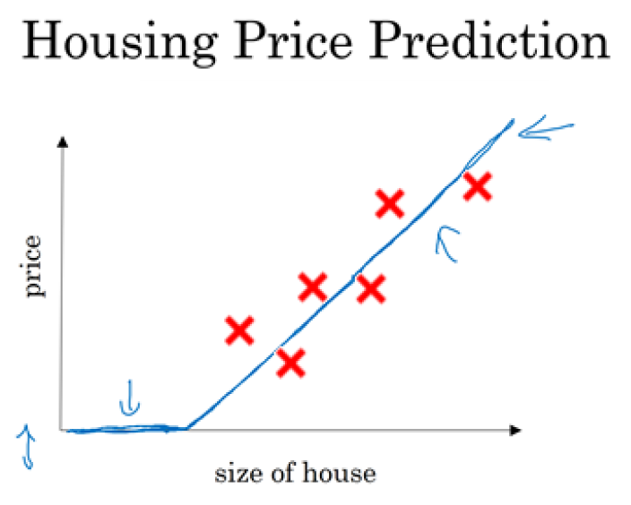
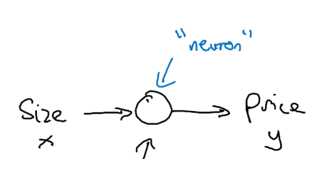
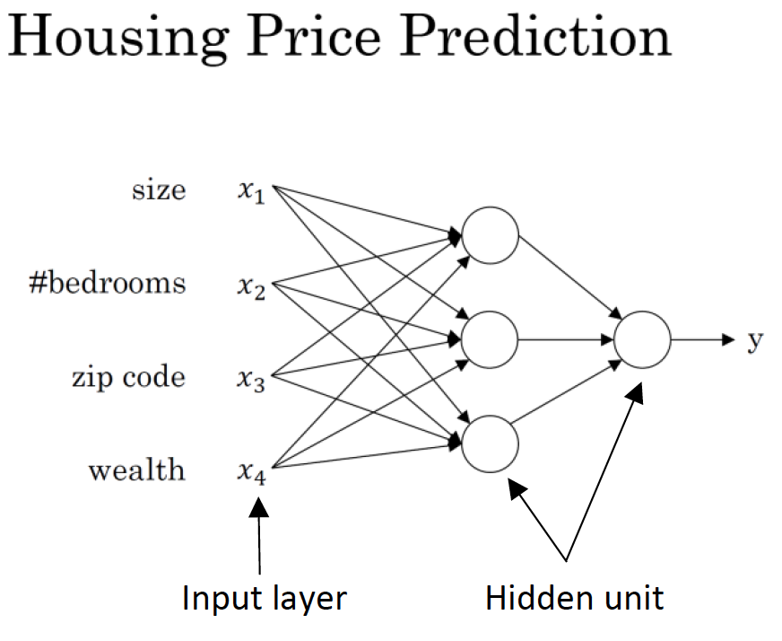
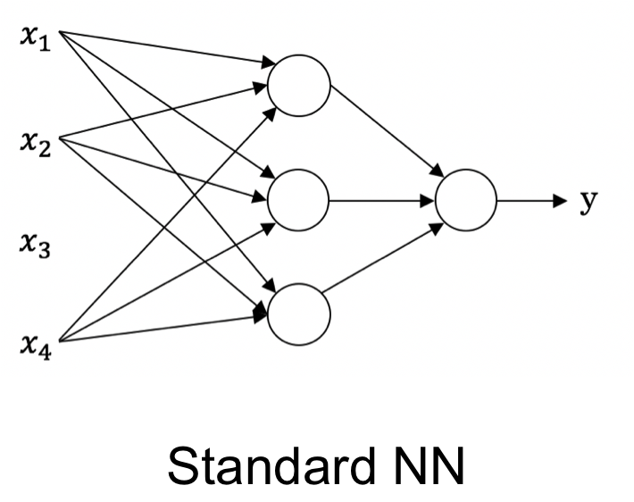
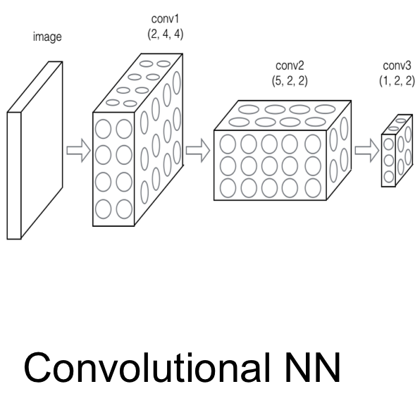
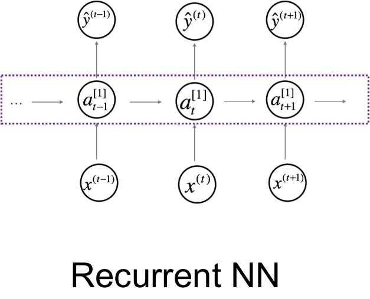
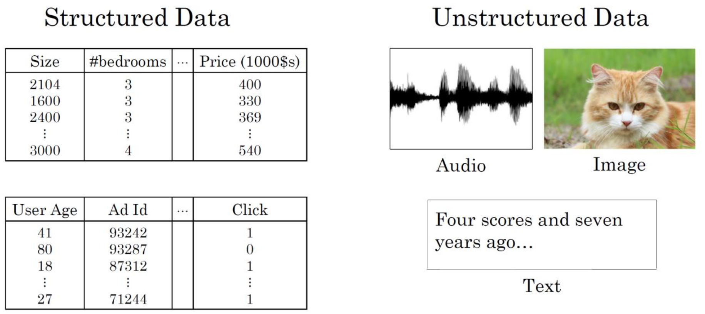
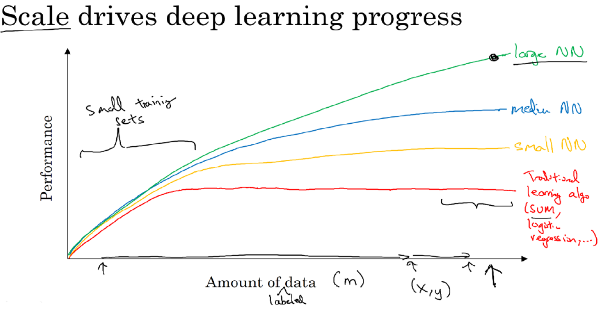
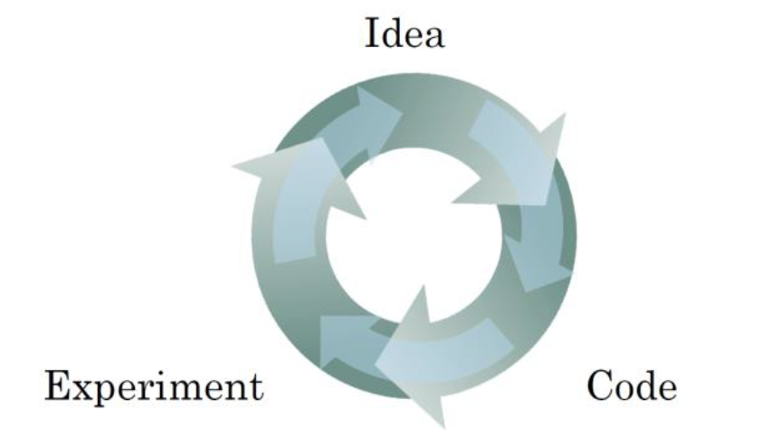

# Week 1. Introduction to deep learning

## What is a Neural Network?

  Deep Learning은 Neural Network를 트레이닝하는 것이다. Neural Network는 뇌의 작동 방식으로부터 영감을 받은 학습 알고리즘이다. Housing Price Prediction 예제를 통해 Neural Network가 무엇인지 알아보자.

### Example 1. Single Neural Network

  

  x축이 size of the house, y축이 price일 때 Housing Price Prediction은 ReLU (Rectified Linear Unit) 함수를 그린다.

  

  * input:  size of the house (x)
  * output: price (y)
  * neuron은 ReLU 함수를 구현한 것이다.

### Example 2. Multiple Neural Networks

  

  price는 size이외에도 bedroom 개수, zip code, wealth 등과 같은 feature들에도 영향을 받는다. Neural Network는 feature들을 input으로 하여 price를 output으로 산출하는데 이때 hidden unit들이 생긴다.

## Supervised Learning with Neural Networks

### Supervised Learning의 정의

  Supervised Learning은 input과 output의 관계가 이미 존재하는 data set이 주어지고 이를 학습하는 Machine Learning의 방법이다. Supervised Learning 문제는 regression 문제와 classification 문제로 분류할 수 있다.

  * regression: input variable을 continuous function에 매핑하여 결과를 예측
  * classification : input variable을 discrete category 안으로 매핑하여 결과 예측

### Supervised Learning에서 Neural Network의 종류

  다음 표는 Supervised Learning의 사례이다.

  

  Real Estate, Online Advertising의 경우 <strong>Standard NN</strong>에 해당한다.

  

  Photo tagging은 <strong>Convolutional NN</strong>에 해당한다.

  

  Speech recognition과 Machine translation (one-dimensional sequence data)은 <strong>Recurrent NN</strong>에 해당한다.

  

  마지막으로 Autonomous driving은 <strong>Hybrid NN</strong>에 해당한다.

### Structured vs unstructured data

  

  * Structured data : 정의된 의미를 가지고 있는 데이터 (databases)
  * Unstructured data : pixel, raw audio, text과 같은 데이터

## Why is Deep Learning taking off?

### Deep learning을 시작할 수 있었던 이유

  

  1. 디지털화된 수많은 데이터
  2. 더욱 더 빨라진 computation
  3. Neural Network 알고리즘 개발의 혁신 (ex. sigmoid --> ReLU)

### 높은 수준의 성능 향상을 가져온 요인

  1. 충분히 크게 Neural Network를 트레이닝할 수 있는 것
  2. 많은 양의 labeled data

### Process of training a Neural Network

  

  NN 트레이닝 과정은 반복적이다. NN 트레이닝의 시간이 좋아졌고 생산성 향상에 영향을 주었다. 더 빠른 computation 새로운 알고리즘을 반복하고 향상시키는 데 도움이 되었다.
