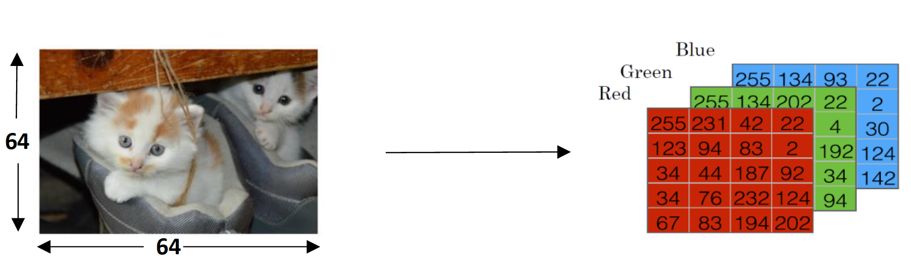
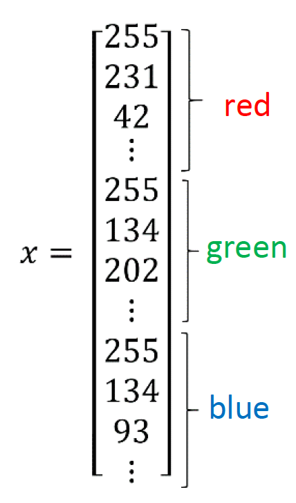
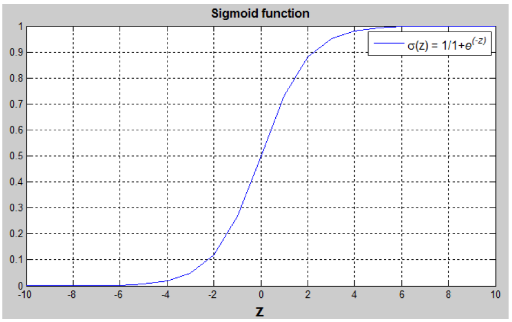
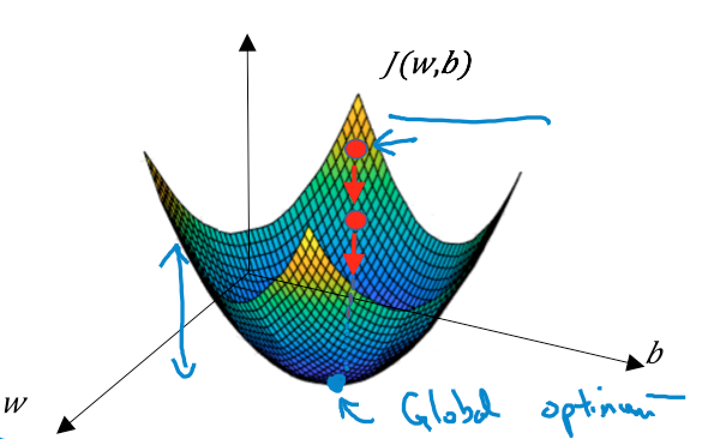

# Week 2. Neural Networks Basics

## Logistic Regression as a Neural Network

### Binary Classification

  binary classification 문제에서 결과값은 1 또는 0이다.

#### Cat vs Non-Cat

  이미지가 주어졌을 때 고양이 이미지이면 1, 고양이 이미지가 아니면 0을 예측하는 예제이다. 고양이 이미지를 feature vector x로 표현한 input으로 classifier를 학습시키고 label y를 예측해본다. y = 1이면 고양이 이미지이고 y = 0이면 고양이 이미지가 아니다.

  이미지는 Red, Green, Blue 각각의 a색에 대응되는 행렬로 구성되어 있다. 이미지의 해상도가 64픽셀 x 64픽셀이라면 Red, Green, Blue가 각각 64 x 64 행렬로 표현된다. 원소값은 픽셀의 intensity 값을 나타낸다.

  

  이미지를 feature vector x로 표현하기 위해서는 세 가지 색의 모든 intensity 값을 n<sub>x</sub> x 1 차원으로 변형시킨다. 이때 n<sub>x</sub>는 세 가지 색의 모든 픽셀값들의 크기이므로 n<sub>x</sub> = 64 x 64 x 3(12288)이다.

  

### Logistic Regression

  Logistic regression은 supervised learning 문제에서 output 𝑦가 0 또는 1일 때 사용하는 learning algorithm이다. Logistic regression의 목적은 예측값과 트레이닝 사이의 오류를 최소화하는 것이다.

  $$x$$ 가 주어졌을 때 $$\hat{y} = P(y=1 | x)$$ 이다. $$\hat{y}$$ 의 범위는 $$0 \leq \hat{y} \leq 1$$ 이다.

  * $$n_{x}$$ : feature 개수
  * input feature vector : $$x \in \mathbb{R}^{n_{x}}$$
  * training label : $$y \in \{0, 1\}$$
  * Parameter : $$w \in \mathbb{R}^{n_{x}}, b \in \mathbb{R}$$
  * output : $$\hat{y} = \sigma(w^Tx + b) = \sigma(z) = \frac{1}{1 + e^{-z}}$$ : Sigmoid function

#### Sigmoid function

  

  * Linear function $$z = w^Tx + b$$의 결과값을 0과 1 사이의 값으로 변환하기 위해 sigmoid function을 사용한다.
  * $$\lim_{z\to\infty} \sigma(z) = 1$$
  * $$\lim_{z\to-\infty} \sigma(z) = 0$$
  * $$z = 0 \to \sigma(z) = 0.5$$

### Logistic Regression: Cost Function

  $$\{(x^{(1)}, y^{(1)}), \dots , (x^{(m)},, y^{(m )} )\}$$ 이 주어졌을 때 $$\hat{y}^{(i)} \approx y^{(i)}$$ 가 되어야 한다. 참고로 $$x^{(i)}$$ 는 $$i$$ 번째 training example을 의미한다.

#### Loss(Error) function

  Loss function은 한 training example에 대한 에러를 계산하는 함수로 prediction $$\hat{y}$$ 와 output $$y$$ 의 차이를 구한다.

  $$L(\hat{y}^{(i)}, y^{(i)}) =  -\{(y^{(i)}\log(\hat{y}^{(i)}) + (1 - y^{(i)})\log(1 - \hat{y}^{(i)})\}$$

  * $$y^{(i)} = 1 \to L(\hat{y}^{(i)}, y^{(i)}) =  -\log(\hat{y}^{(i)})$$. 에러를 최소화하기 위해서는  $$-\log(\hat{y}^{(i)}) \to 0$$ 이므로 $$\hat{y}^{(i)} \to 1$$ 이 된다.
  * $$y^{(i)} = 0 \to L(\hat{y}^{(i)}, y^{(i)}) =  -\log(1 - \hat{y}^{(i)})$$. 에러를 최소화하기 위해서는  $$-\log(1- \hat{y}^{(i)}) \to 0$$ 이므로 $$\hat{y}^{(i)} \to 0$$ 이 된다.

#### Cost function

  Cost function은 전체 training set의 loss function의 평균이다.

  $$J(w, b) = \frac{1}{m}\sum_{i = 1}^{m}L(\hat{y}^{(i)}, y^{(i)}) = -\frac{1}{m}\sum_{i = 1}^{m}\{y^{(i)}\log(\hat{y}^{(i)}) + (1 - y^{(i)})\log(1 - \hat{y}^{(i)})\}$$

### Gradient Descent

  Cost function $$J(w, b)$$ 를 최소화하는 Parameter $$w$$, $$b$$ 를 구해야 한다.

  
  repeat { <br>
  $$w := w - \alpha\frac{\partial J(w, b)}{\partial w}$$ <br>
  
  $$b := b - \alpha\frac{\partial J(w, b)}{\partial b}$$ <br>

  }
  * $$\alpha$$ : learning rate


## Python and Vectorization

### Vectorization

  $$w, x \in \mathbb{R}^{n_{x}}$$
  
#### Non-vectorized version

  ```py
  z = 0
  for i in range(n_x):
    z += w[i] * x[i]
  z += b
  ```
#### Vectorized version
  
  ```py
  z = np.dot(w.T, x) + b
  ```